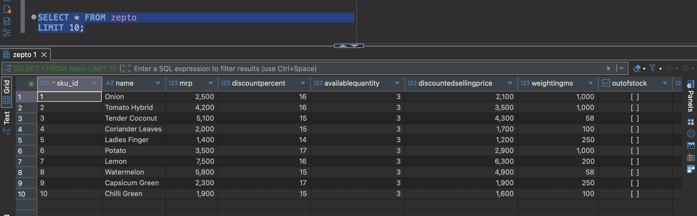
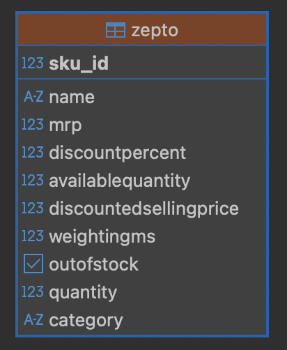
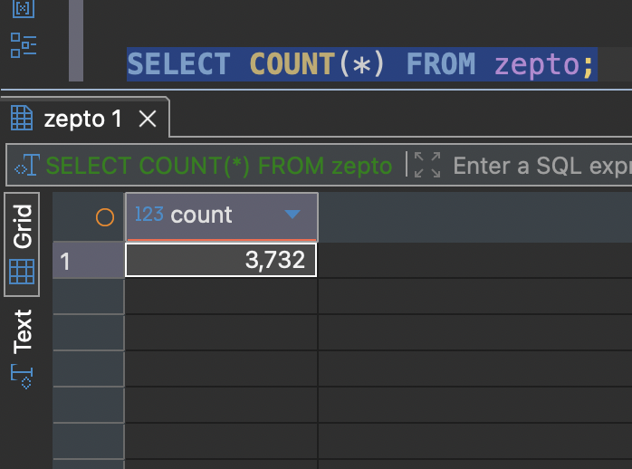
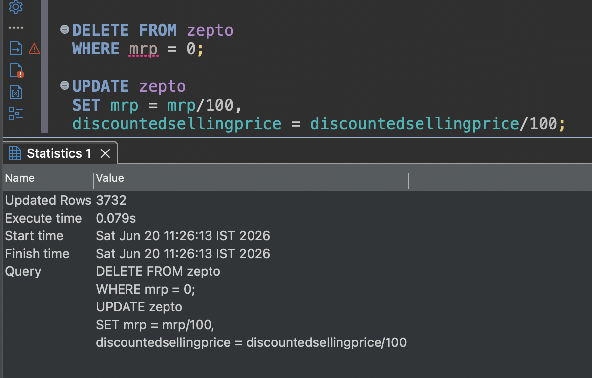
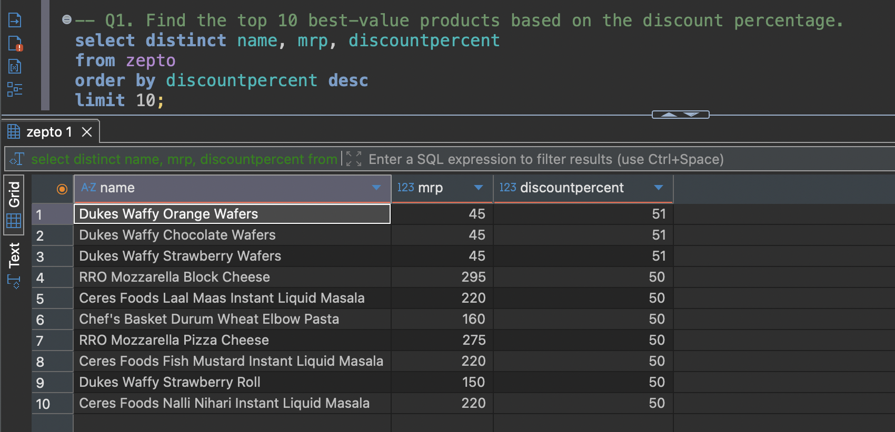
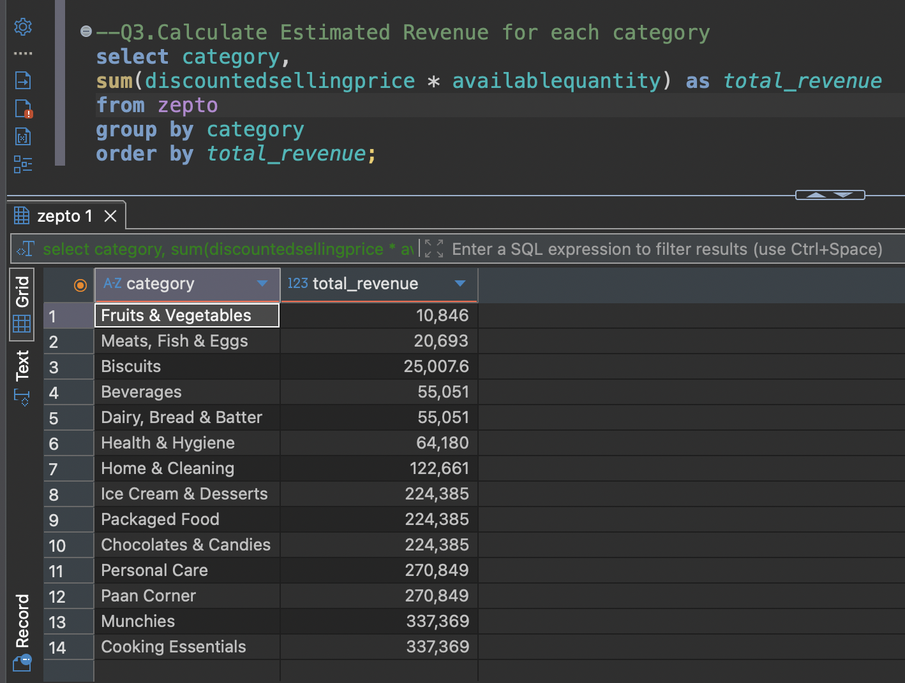
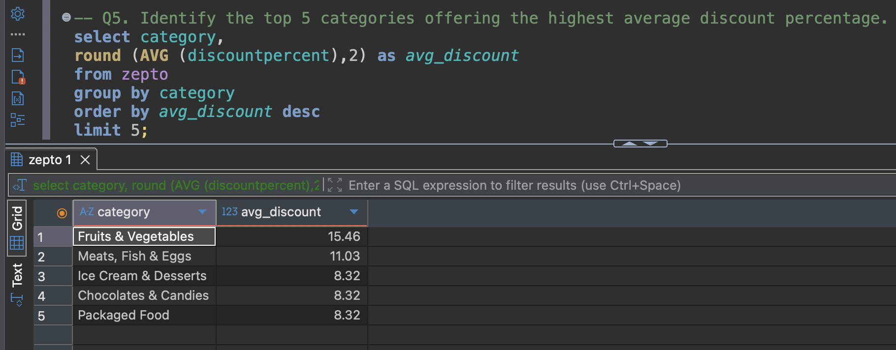
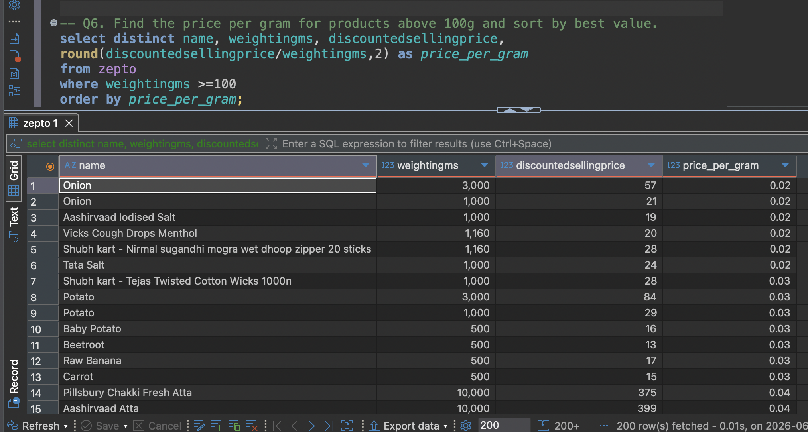
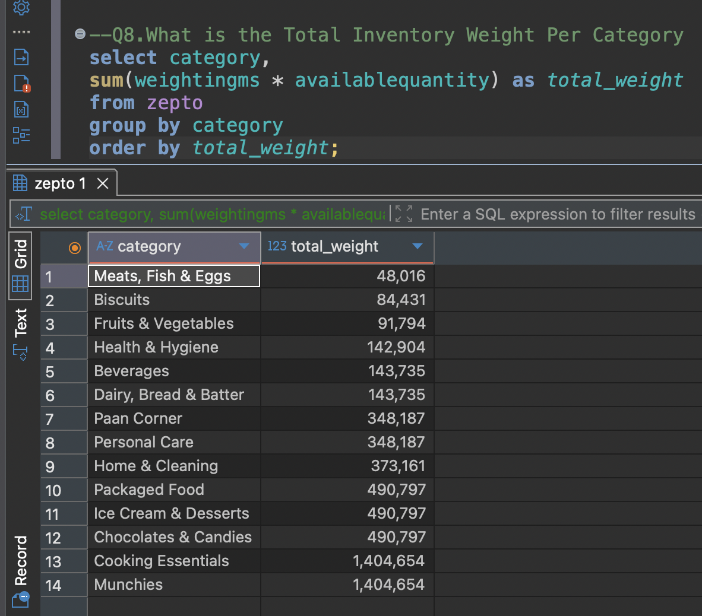

# 🛒 Zepto E-commerce SQL Project

## 📌 Project Overview

This project analyzes a real-world Zepto e-commerce dataset using SQL. The objective is to demonstrate SQL skills required for Data Analyst roles, including data exploration, cleaning, aggregation, business analysis, and reporting.

The project answers common business questions such as:

* Which products offer the highest discounts?
* Which expensive products are currently out of stock?
* Which product categories generate the highest estimated revenue?
* Which categories provide the highest average discounts?
* What is the inventory weight available for each category?

---

## 🛠️ Tech Stack

* SQL
* PostgreSQL
* DBeaver

---

## 📂 Dataset Information

The dataset contains product-level information from Zepto, including:

* SKU ID
* Product Name
* Category
* MRP
* Discount Percentage
* Discounted Selling Price
* Available Quantity
* Product Weight
* Stock Availability
* Quantity

  ## 📂 Dataset Preview



---

## 🗄️ Database Schema

```sql
sku_id

name

category

mrp

discountpercent

availablequantity

discountedsellingprice

weightingms

outofstock

quantity
```
 
---

## Key Insights

- Grocery category generated the highest estimated revenue.
- Several premium products were out of stock.
- Some products offered discounts above 70%.
- Categories showed significant variation in average discount percentages.

---

## 📊 Project Workflow

### 1. Data Exploration

Performed exploratory analysis including:

* Total number of products
* Sample data inspection
* Missing value detection
* Distinct product categories
* In-stock vs out-of-stock products
* Duplicate product names

---

### 2. Data Cleaning

Cleaning steps performed:

* Removed products having MRP = 0
* Converted prices from paise to rupees
* Validated cleaned data

---

### 3. Business Analysis

The project answers the following business questions:

### Q1. Top 10 Best-Value Products

Products with the highest discount percentage.



### Q2. High MRP Products Currently Out of Stock

Identifies expensive products unavailable for purchase.

### Q3. Estimated Revenue by Category

Calculates potential revenue using:

Revenue = Discounted Selling Price × Available Quantity



### Q4. Premium Products with Low Discounts

Products priced above ₹500 but offering less than 10% discount.

### Q5. Categories Offering Highest Average Discount

Ranks categories based on average discount percentage.



### Q6. Best Value Based on Price per Gram

Calculates price per gram for products weighing at least 100g.



### Q7. Product Weight Classification

Groups products into:

* Low
* Medium
* Bulk

based on product weight.

### Q8. Total Inventory Weight per Category

Calculates the total inventory weight available for every category.



---

## 📈 SQL Concepts Used

* CREATE TABLE
* DROP TABLE
* INSERT
* UPDATE
* DELETE
* SELECT
* DISTINCT
* WHERE
* GROUP BY
* HAVING
* ORDER BY
* LIMIT
* Aggregate Functions

  * COUNT()
  * SUM()
  * AVG()
* CASE WHEN
* Data Cleaning
* Business Analysis Queries

---

## 🚀 Skills Demonstrated

* SQL Query Writing
* Data Cleaning
* Data Exploration
* Data Aggregation
* Business Problem Solving
* Data Analysis
* Reporting

---

## 📁 Files Included

```
Zepto-SQL-Project/
│
├── README.md
|
├── zepto_sql_project.sql
|
└── zepto_dataset.csv
```

---

## 🎯 Project Outcome

This project demonstrates practical SQL skills by solving real-world business problems using an e-commerce dataset. It showcases the ability to clean, explore, analyze, and extract meaningful insights from data, making it suitable for Data Analyst portfolio projects.

---

## ⭐ If you found this project useful, consider giving it a Star.
